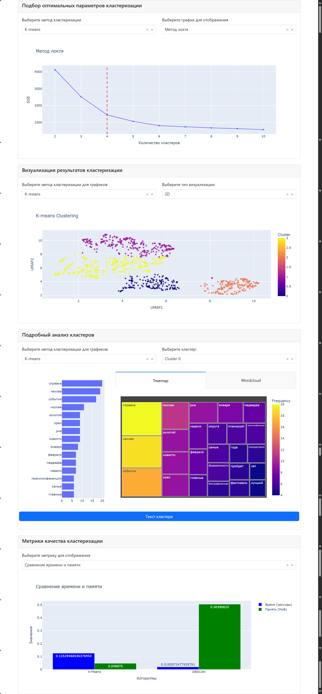
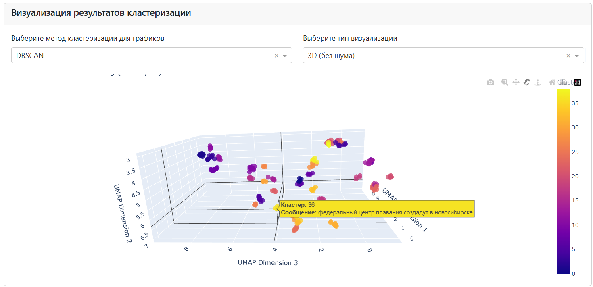

# Interactive Text Clustering Analysis

## Описание
Этот проект представляет собой интерактивное приложение для анализа и визуализации кластеризации текстовых данных. Оно включает в себя методы кластеризации K-means и DBSCAN, а также позволяет пользователям исследовать результаты кластеризации с помощью интерактивных графиков.

## Технологии
- Python 3.8+
- Dash и Plotly
- Scikit-learn
- UMAP
- NLTK
- pandas

## Использование
После запуска приложения, откройте браузер и перейдите по адресу `http://127.0.0.1:8050/`. 
Вы сможете:
- Выбрать метод кластеризации и увидеть, как изменяется визуализация в зависимости от выбранных параметров.
- Просматривать результаты кластеризации в виде 2D и 3D графиков.
- Анализировать кластеры с помощью графиков Treemap и облаков слов.

